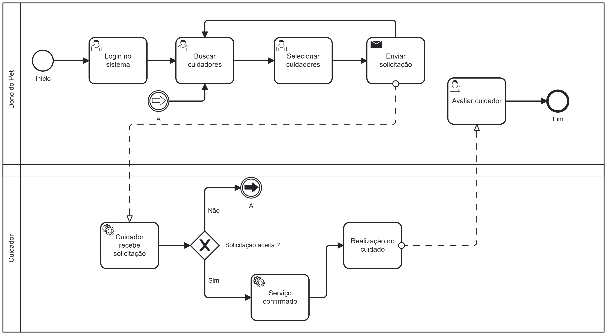
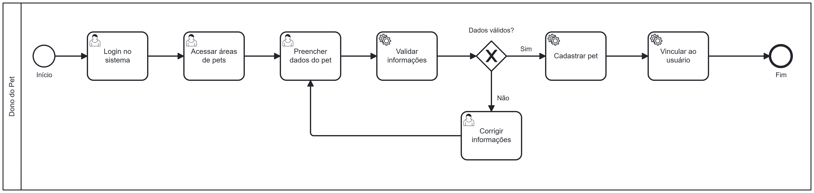
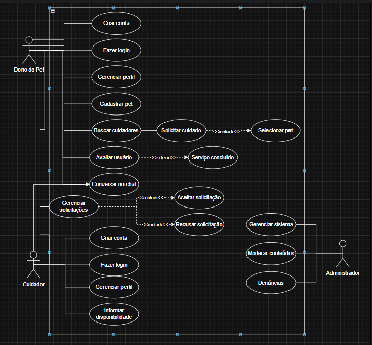
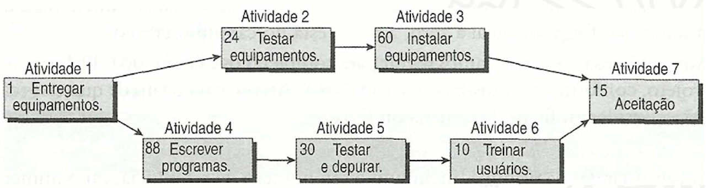
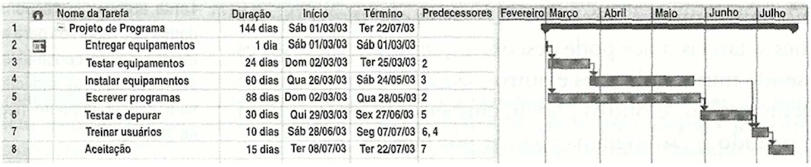
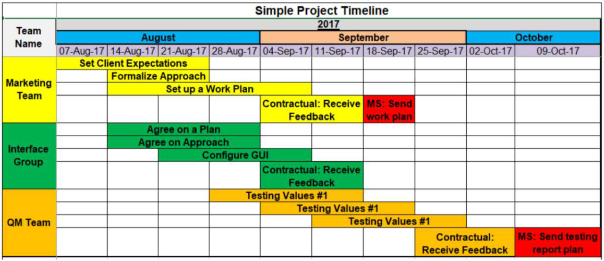
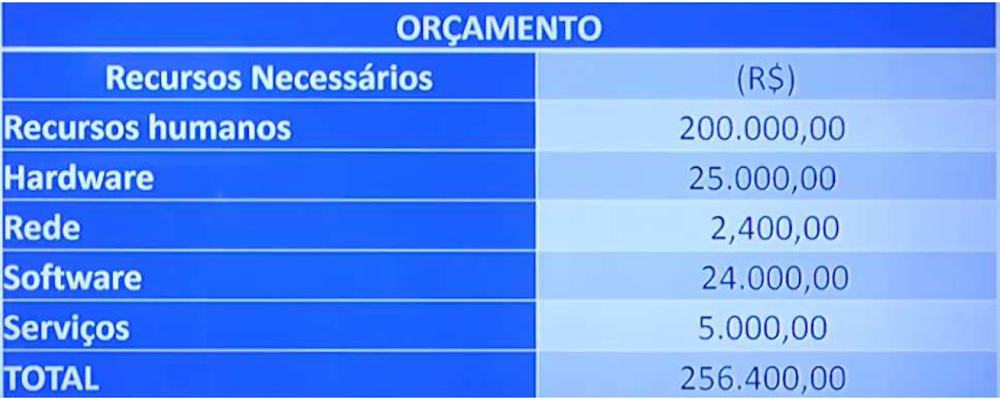

# Especificações do Projeto

A plataforma PetShare foi idealizada para solucionar a dificuldade enfrentada por donos de animais de estimação ao buscar pessoas confiáveis para cuidar de seus pets durante viagens, compromissos ou longas jornadas de trabalho. Atualmente, muitos tutores dependem de amigos, familiares ou hotéis especializados, o que pode gerar altos custos, insegurança e falta de praticidade.

Diante desse cenário, o projeto propõe o desenvolvimento de uma plataforma web colaborativa de pet sitting comunitário, permitindo a conexão entre donos de pets e cuidadores da mesma região, promovendo confiança, praticidade e acessibilidade.

Esta seção apresenta a definição do problema, as personas envolvidas, histórias de usuários, requisitos funcionais e não funcionais, restrições do projeto e demais elementos necessários para a especificação da solução proposta.

## Personas

### Persona 1: Mariana Souza — Dona de Pet

Mariana Souza tem 32 anos, é Analista de Marketing Digital e mora em São Paulo – SP. Trabalha em modelo híbrido e possui uma rotina agitada, com viagens frequentes e longos períodos fora de casa. É organizada, responsável e utiliza aplicativos constantemente para facilitar tarefas do dia a dia.

Mariana possui um cachorro chamado Thor, que considera parte da família, e busca uma solução segura para encontrar cuidadores confiáveis quando precisa viajar ou trabalhar até tarde. Seu principal objetivo é garantir o bem-estar do pet por meio de uma plataforma simples, rápida e confiável.

### Persona 2: Lucas Almeida — Cuidador

Lucas Almeida tem 25 anos, é estudante de Medicina Veterinária e mora em Belo Horizonte – MG. Trabalha como cuidador freelancer de animais e busca oportunidades para ganhar experiência prática e renda extra. É empático, proativo e possui facilidade para lidar com pets.

Lucas possui horários flexíveis durante a tarde e noite, e procura uma plataforma que facilite a divulgação de seus serviços e o contato com donos de animais próximos à sua região.

## Histórias de Usuários

Com base na análise das personas e nas funcionalidades definidas para o MVP da plataforma PetShare, foram identificadas as seguintes histórias de usuário. Essas histórias representam as principais necessidades dos usuários do sistema e auxiliam na elicitação dos requisitos funcionais e não funcionais da aplicação.

As histórias foram agrupadas por contexto funcional, visando facilitar a organização e o entendimento do fluxo do sistema.

---

### 1. Contexto: Autenticação e Acesso

| EU COMO... | QUERO/PRECISO... | PARA... |
|---|---|---|
| Usuário do sistema | Criar uma conta utilizando e-mail e senha | acessar as funcionalidades da plataforma |
| Usuário do sistema | Realizar login no sistema | acessar meu perfil e minhas informações |
| Usuário do sistema | Recuperar minha senha | conseguir acessar novamente minha conta em caso de esquecimento |
| Usuário do sistema | Encerrar minha sessão (logout) | proteger minhas informações pessoais |

---

### 2. Contexto: Gerenciamento de Perfil

| EU COMO... | QUERO/PRECISO... | PARA... |
|---|---|---|
| Dono de pet | Editar minhas informações pessoais | manter meus dados atualizados |
| Cuidador | Adicionar informações sobre minha experiência com animais | transmitir maior confiança aos usuários |
| Usuário do sistema | Adicionar uma foto ao meu perfil | facilitar minha identificação na plataforma |
| Cuidador | Informar minha disponibilidade de horários | receber solicitações compatíveis com minha rotina |

---

### 3. Contexto: Cadastro e Gerenciamento de Pets

| EU COMO... | QUERO/PRECISO... | PARA... |
|---|---|---|
| Dono de pet | Cadastrar meu animal de estimação | informar suas características aos cuidadores |
| Dono de pet | Adicionar informações como raça, porte e idade do pet | facilitar a escolha do cuidador adequado |
| Dono de pet | Informar necessidades especiais do meu pet | garantir cuidados apropriados durante o serviço |
| Dono de pet | Editar os dados do meu pet | manter as informações sempre corretas |

---

### 4. Contexto: Busca de Cuidadores

| EU COMO... | QUERO/PRECISO... | PARA... |
|---|---|---|
| Dono de pet | Buscar cuidadores próximos da minha localização | encontrar ajuda rapidamente |
| Dono de pet | Filtrar cuidadores por tipo e porte de animal | encontrar profissionais compatíveis com meu pet |
| Dono de pet | Visualizar avaliações de outros usuários | escolher cuidadores confiáveis |
| Dono de pet | Visualizar informações do cuidador | conhecer sua experiência e disponibilidade |

---

### 5. Contexto: Solicitação de Cuidados

| EU COMO... | QUERO/PRECISO... | PARA... |
|---|---|---|
| Dono de pet | Solicitar um serviço de cuidado | encontrar alguém para cuidar do meu animal |
| Dono de pet | Informar data, horário e observações na solicitação | garantir que o cuidador compreenda minhas necessidades |
| Cuidador | Receber notificações de novas solicitações | responder rapidamente aos pedidos |
| Cuidador | Aceitar ou recusar solicitações de cuidado | organizar minha disponibilidade |

---

### 6. Contexto: Comunicação Entre Usuários

| EU COMO... | QUERO/PRECISO... | PARA... |
|---|---|---|
| Dono de pet | Conversar diretamente com o cuidador | alinhar detalhes do serviço |
| Cuidador | Trocar mensagens com o dono do pet | esclarecer dúvidas sobre o animal |
| Usuário do sistema | Receber notificações de novas mensagens | acompanhar a comunicação em tempo real |

---

### 7. Contexto: Avaliações e Reputação

| EU COMO... | QUERO/PRECISO... | PARA... |
|---|---|---|
| Dono de pet | Avaliar o cuidador após o serviço | compartilhar minha experiência com outros usuários |
| Cuidador | Receber avaliações positivas | aumentar minha reputação na plataforma |
| Usuário do sistema | Visualizar avaliações anteriores | aumentar minha confiança antes de contratar um serviço |
| Usuário do sistema | Consultar a reputação de um cuidador | tomar decisões mais seguras |

---

### 8. Contexto: Administração do Sistema

| EU COMO... | QUERO/PRECISO... | PARA... |
|---|---|---|
| Administrador | Gerenciar contas de usuários | manter o funcionamento adequado da plataforma |
| Administrador | Remover conteúdos inadequados | garantir um ambiente seguro para os usuários |
| Administrador | Monitorar avaliações e denúncias | evitar comportamentos abusivos |
| Administrador | Gerenciar dados do sistema | manter a integridade das informações |

## Modelagem do Processo de Negócio

### Análise da Situação Atual

Atualmente, donos de animais de estimação enfrentam dificuldades para encontrar pessoas confiáveis e disponíveis para cuidar de seus pets durante viagens, compromissos profissionais ou longos períodos fora de casa. Na maioria dos casos, os usuários dependem de alternativas informais, como pedir ajuda para amigos, familiares ou vizinhos, além da contratação de hotéis para animais e serviços particulares divulgados em redes sociais.

Entretanto, essas soluções apresentam diversos problemas, como altos custos, baixa flexibilidade, dificuldade de encontrar cuidadores próximos e ausência de mecanismos de confiança e avaliação. Muitas vezes, os donos de pets não possuem informações suficientes sobre a experiência ou reputação dos cuidadores, gerando insegurança ao deixar seus animais sob responsabilidade de terceiros.

Além disso, o processo atual ocorre de maneira descentralizada e pouco organizada. As negociações normalmente são realizadas por aplicativos de mensagens ou redes sociais, dificultando o acompanhamento das solicitações, o controle das informações e a comunicação entre as partes envolvidas.

Do ponto de vista dos cuidadores, também existem limitações significativas. Muitos cuidadores autônomos possuem dificuldades para divulgar seus serviços, conquistar novos clientes e construir uma reputação confiável. A dependência de indicações pessoais limita o alcance de oportunidades e reduz a visibilidade desses profissionais.

Dessa forma, observa-se a necessidade de uma solução tecnológica que centralize o processo de conexão entre donos de pets e cuidadores, promovendo segurança, praticidade, organização e acessibilidade para ambos os lados.

---

### Descrição Geral da Proposta

A proposta do projeto PetShare consiste no desenvolvimento de uma plataforma web colaborativa voltada para o serviço de pet sitting comunitário. O sistema tem como principal objetivo conectar donos de animais de estimação a cuidadores próximos de sua localização, permitindo a realização de solicitações de cuidado de forma simples, rápida e segura.

A plataforma permitirá que usuários realizem cadastro e gerenciamento de perfil, cadastro de pets, busca de cuidadores por localização, envio de solicitações de cuidado, troca de mensagens por meio de chat interno e avaliações após a conclusão dos serviços.

O diferencial da solução está na criação de uma rede comunitária baseada em confiança, reputação e proximidade geográfica, possibilitando que os usuários encontrem cuidadores bem avaliados dentro da própria região. Além disso, o sistema busca oferecer uma alternativa mais acessível e flexível em comparação aos modelos tradicionais de hospedagem para animais.

Como MVP (Minimum Viable Product), o projeto será inicialmente desenvolvido como uma aplicação web, focando apenas nas funcionalidades essenciais para validar a aceitação da proposta pelos usuários e verificar a viabilidade do modelo de negócio.

Entre as principais oportunidades de melhoria proporcionadas pela solução, destacam-se:

- Centralização das informações e solicitações em uma única plataforma;
- Redução da insegurança na contratação de cuidadores;
- Facilidade de comunicação entre donos de pets e cuidadores;
- Maior visibilidade para cuidadores autônomos;
- Utilização de avaliações e reputação como mecanismo de confiança;
- Agilidade na busca de cuidadores próximos;
- Redução de custos em comparação a hotéis especializados;
- Melhor organização e acompanhamento das solicitações de cuidado.

Além disso, futuramente o sistema poderá incorporar novas funcionalidades, como geolocalização em tempo real, integração com pagamentos online, notificações push, aplicativo mobile e integração com serviços veterinários parceiros.

## Processo 1 – Solicitação de Cuidado de Pet

O processo de solicitação de cuidado de pet representa o principal fluxo de funcionamento da plataforma PetShare. Esse processo envolve a interação entre o dono do pet e o cuidador, desde a busca por cuidadores disponíveis até a confirmação do serviço solicitado.

Atualmente, esse processo ocorre de maneira informal, normalmente por meio de redes sociais, aplicativos de mensagens e indicações pessoais, dificultando a organização das informações, a comunicação entre as partes e a verificação da confiabilidade dos cuidadores.

Com a implementação da plataforma PetShare, o processo será centralizado em um único sistema, proporcionando maior segurança, praticidade e controle das solicitações realizadas.

### Oportunidades de Melhoria

A implementação deste processo na plataforma permitirá as seguintes melhorias:

- Centralização das solicitações de cuidado em um único ambiente;
- Facilidade para encontrar cuidadores próximos;
- Maior organização das informações dos pets e dos serviços;
- Redução da insegurança na contratação de cuidadores;
- Comunicação direta entre dono do pet e cuidador;
- Acompanhamento do status das solicitações;
- Agilidade no aceite ou recusa de pedidos;
- Registro de histórico e avaliações dos serviços realizados.

---

### Modelo BPMN – Processo de Solicitação de Cuidado

Fluxo do processo:

1. O dono do pet acessa a plataforma.
2. O usuário realiza login no sistema.
3. O sistema apresenta a busca de cuidadores disponíveis.
4. O dono do pet seleciona um cuidador.
5. O usuário envia uma solicitação de cuidado contendo data, horário e informações do pet.
6. O cuidador recebe a solicitação.
7. O cuidador analisa o pedido recebido.
8. O cuidador decide aceitar ou recusar a solicitação.
9. Caso aceite, o serviço é confirmado.
10. Caso recuse, o dono do pet poderá buscar outro cuidador.
11. Após a realização do serviço, o dono do pet poderá avaliar o cuidador.
12. O processo é encerrado.

---

### Representação Simplificada do Fluxo BPMN

## Processo 2 – Cadastro e Gerenciamento de Pets

O processo de cadastro e gerenciamento de pets representa uma das funcionalidades essenciais da plataforma PetShare, permitindo que os donos de animais registrem informações importantes sobre seus pets para facilitar a contratação de cuidadores adequados.

Atualmente, as informações sobre os animais normalmente são compartilhadas de forma informal por mensagens ou conversas diretas, o que dificulta a padronização dos dados e pode causar falhas de comunicação entre donos de pets e cuidadores.

Com a implementação da plataforma PetShare, todas as informações relacionadas aos pets serão centralizadas em um único ambiente, permitindo maior organização, segurança e praticidade durante o processo de solicitação de cuidados.

### Oportunidades de Melhoria

A implementação deste processo proporcionará as seguintes melhorias:

- Centralização das informações dos pets;
- Facilidade no compartilhamento de dados importantes;
- Melhor comunicação entre dono do pet e cuidador;
- Redução de erros e omissão de informações;
- Organização do histórico de pets cadastrados;
- Agilidade no processo de solicitação de cuidados;
- Maior segurança para os cuidadores ao conhecer as necessidades do animal.

---

### Modelo BPMN – Processo de Cadastro de Pet

Fluxo do processo:

1. O usuário acessa a plataforma.
2. O usuário realiza login no sistema.
3. O usuário acessa a área de cadastro de pets.
4. O sistema solicita as informações do animal.
5. O usuário preenche os dados do pet.
6. O sistema valida as informações inseridas.
7. Caso os dados estejam corretos, o cadastro é realizado.
8. Caso existam erros ou campos inválidos, o sistema solicita correção.
9. O pet é vinculado ao perfil do usuário.
10. O processo é encerrado.

---

### Representação Simplificada do Fluxo BPMN

 

## Indicadores de Desempenho

Os indicadores de desempenho apresentados a seguir têm como objetivo monitorar a eficiência, qualidade e confiabilidade dos principais processos da plataforma PetShare. Esses indicadores auxiliarão no acompanhamento da utilização do sistema, satisfação dos usuários e desempenho operacional da solução.

Todas as informações necessárias para geração desses indicadores estarão contempladas no diagrama de classes do sistema, por meio das entidades relacionadas a usuários, pets, solicitações, mensagens, avaliações e notificações.

| Indicador | Objetivo | Descrição | Cálculo | Fonte de Dados | Perspectiva |
|---|---|---|---|---|---|
| Taxa de Solicitações Aceitas | Avaliar a disponibilidade e aceitação dos cuidadores | Mede o percentual de solicitações de cuidado aceitas pelos cuidadores | (Solicitações Aceitas / Total de Solicitações) × 100 | Tabela de Solicitações | Processos Internos |
| Tempo Médio de Resposta | Melhorar a agilidade no atendimento | Mede o tempo médio que o cuidador leva para responder uma solicitação | Soma dos tempos de resposta / Total de solicitações respondidas | Tabela de Solicitações e Notificações | Cliente |
| Média de Avaliação dos Cuidadores | Avaliar a qualidade dos serviços prestados | Mede a média das avaliações recebidas pelos cuidadores após os serviços | Soma das avaliações / Quantidade de avaliações | Tabela de Avaliações | Cliente |
| Percentual de Reclamações | Avaliar quantitativamente os problemas relatados pelos usuários | Mede o percentual de reclamações registradas em relação ao número de serviços realizados | (Número de Reclamações / Total de Serviços) × 100 | Tabela de Reclamações | Aprendizado e Crescimento |
| Número de Usuários Ativos | Monitorar o crescimento e utilização da plataforma | Mede a quantidade de usuários que utilizaram o sistema em determinado período | Total de usuários ativos no período | Tabela de Usuários | Financeira |
| Taxa de Conclusão de Serviços | Verificar a efetividade das solicitações realizadas | Mede o percentual de serviços concluídos com sucesso | (Serviços Concluídos / Solicitações Aceitas) × 100 | Tabela de Solicitações | Processos Internos |
| Tempo Médio de Busca por Cuidador | Avaliar a eficiência da plataforma na localização de cuidadores | Mede o tempo médio gasto pelo usuário para encontrar um cuidador disponível | Soma dos tempos de busca / Total de buscas realizadas | Tabela de Buscas e Solicitações | Cliente |

## Requisitos

Os requisitos apresentados a seguir foram definidos com base nas histórias de usuário, personas e funcionalidades identificadas durante as etapas de Lean Inception e Product Backlog Building do projeto PetShare.

Para definição das prioridades foi utilizada a técnica de priorização **MoSCoW**, classificando os requisitos em:

- **ALTA (Must Have):** funcionalidades essenciais para o funcionamento do MVP;
- **MÉDIA (Should Have):** funcionalidades importantes, mas não críticas para a primeira versão;
- **BAIXA (Could Have):** funcionalidades desejáveis, porém não obrigatórias no MVP.

---

### Requisitos Funcionais

| ID | Descrição do Requisito | Prioridade |
|---|---|---|
| RF-001 | Permitir que usuários realizem cadastro utilizando e-mail e senha | ALTA |
| RF-002 | Permitir autenticação de usuários através de login | ALTA |
| RF-003 | Permitir recuperação de senha | MÉDIA |
| RF-004 | Permitir edição de informações do perfil do usuário | ALTA |
| RF-005 | Permitir cadastro de foto de perfil | MÉDIA |
| RF-006 | Permitir que cuidadores informem disponibilidade de horários | MÉDIA |
| RF-007 | Permitir cadastro de pets vinculados ao usuário | ALTA |
| RF-008 | Permitir edição das informações dos pets cadastrados | MÉDIA |
| RF-009 | Permitir informar características e necessidades especiais do pet | ALTA |
| RF-010 | Permitir busca de cuidadores por localização | ALTA |
| RF-011 | Permitir filtragem de cuidadores por tipo e porte de animal | MÉDIA |
| RF-012 | Permitir visualização do perfil e avaliações dos cuidadores | ALTA |
| RF-013 | Permitir envio de solicitações de cuidado | ALTA |
| RF-014 | Permitir que cuidadores aceitem ou recusem solicitações | ALTA |
| RF-015 | Permitir troca de mensagens entre dono do pet e cuidador | MÉDIA |
| RF-016 | Permitir envio de notificações sobre alterações nas solicitações | MÉDIA |
| RF-017 | Permitir avaliação de cuidadores após a conclusão do serviço | ALTA |
| RF-018 | Permitir visualização do histórico de solicitações realizadas | MÉDIA |
| RF-019 | Permitir gerenciamento de usuários pelo administrador | BAIXA |
| RF-020 | Permitir remoção de conteúdos inadequados pelo administrador | BAIXA |

---

### Requisitos Não Funcionais

| ID | Descrição do Requisito | Prioridade |
|---|---|---|
| RNF-001 | O sistema deve possuir interface responsiva para dispositivos móveis | ALTA |
| RNF-002 | O sistema deve processar requisições em no máximo 3 segundos | MÉDIA |
| RNF-003 | O sistema deve utilizar autenticação segura para proteção de dados dos usuários | ALTA |
| RNF-004 | O sistema deve armazenar senhas utilizando criptografia | ALTA |
| RNF-005 | O sistema deve estar disponível 24 horas por dia | MÉDIA |
| RNF-006 | O sistema deve ser compatível com os navegadores Google Chrome e Mozilla Firefox | MÉDIA |
| RNF-007 | O sistema deve seguir os princípios de usabilidade e acessibilidade | MÉDIA |
| RNF-008 | O sistema deve permitir fácil manutenção e atualização do código | BAIXA |
| RNF-009 | O sistema deve garantir integridade das informações cadastradas | ALTA |
| RNF-010 | O sistema deve proteger os dados dos usuários conforme a LGPD | ALTA |

## Restrições

O projeto está restrito pelos itens apresentados na tabela a seguir.

|ID| Restrição                                             |
|--|-------------------------------------------------------|
|01| O projeto deverá ser entregue até o final do semestre |
|02| Não pode ser desenvolvido um módulo de backend        |

Enumere as restrições à sua solução. Lembre-se de que as restrições geralmente limitam a solução candidata.

> **Links Úteis**:
> - [O que são Requisitos Funcionais e Requisitos Não Funcionais?](https://codificar.com.br/requisitos-funcionais-nao-funcionais/)
> - [O que são requisitos funcionais e requisitos não funcionais?](https://analisederequisitos.com.br/requisitos-funcionais-e-requisitos-nao-funcionais-o-que-sao/)

# Diagrama de Casos de Uso

O diagrama de casos de uso tem como objetivo representar graficamente as principais funcionalidades da plataforma PetShare, identificando os atores envolvidos e suas interações com o sistema.

Os casos de uso foram elaborados com base nas histórias de usuário e requisitos funcionais definidos nas etapas anteriores do projeto, permitindo visualizar os principais fluxos de utilização da plataforma.

Os principais atores identificados foram:
- Dono do Pet;
- Cuidador;
- Administrador.

O diagrama contempla as funcionalidades essenciais do MVP da plataforma, incluindo autenticação, gerenciamento de perfil, cadastro de pets, busca de cuidadores, solicitação de cuidados, comunicação entre usuários e sistema de avaliações.

# Matriz de Rastreabilidade

A matriz de rastreabilidade tem como objetivo estabelecer a relação entre os objetivos de negócio, histórias de usuário, requisitos funcionais e casos de uso da plataforma PetShare. Essa técnica permite acompanhar a origem e o impacto de cada requisito dentro do sistema, garantindo maior controle, organização e consistência entre os artefatos produzidos durante o desenvolvimento do projeto.

A rastreabilidade auxilia na validação dos requisitos, na identificação de dependências e na verificação de cobertura das funcionalidades previstas para o MVP do sistema.

---

# Matriz de Rastreabilidade

| Objetivo de Negócio | História de Usuário | Requisito Funcional | Caso de Uso |
|---|---|---|---|
| Facilitar o acesso à plataforma | Eu, como usuário, desejo criar uma conta para acessar o sistema | RF-001 – Cadastro de usuários | Criar Conta |
| Garantir acesso seguro ao sistema | Eu, como usuário, desejo fazer login no sistema | RF-002 – Autenticação de usuários | Fazer Login |
| Permitir recuperação de acesso | Eu, como usuário, desejo recuperar minha senha | RF-003 – Recuperação de senha | Recuperar Senha |
| Permitir gerenciamento de perfil | Eu, como usuário, desejo editar meus dados pessoais | RF-004 – Gerenciamento de perfil | Gerenciar Perfil |
| Melhorar identificação dos usuários | Eu, como usuário, desejo adicionar foto ao perfil | RF-005 – Cadastro de foto de perfil | Gerenciar Perfil |
| Facilitar organização dos cuidadores | Eu, como cuidador, desejo informar minha disponibilidade | RF-006 – Disponibilidade de horários | Informar Disponibilidade |
| Permitir registro de animais | Eu, como dono de pet, desejo cadastrar meu pet | RF-007 – Cadastro de pets | Cadastrar Pet |
| Manter informações atualizadas | Eu, como dono de pet, desejo editar os dados do meu pet | RF-008 – Edição de pets | Editar Pet |
| Garantir cuidados adequados | Eu, como dono de pet, desejo informar necessidades especiais do pet | RF-009 – Informações do pet | Gerenciar Pet |
| Facilitar busca de cuidadores | Eu, como dono de pet, desejo buscar cuidadores próximos | RF-010 – Busca de cuidadores | Buscar Cuidador |
| Melhorar compatibilidade dos serviços | Eu, como dono de pet, desejo aplicar filtros de busca | RF-011 – Filtragem de cuidadores | Filtrar Cuidadores |
| Aumentar confiança na contratação | Eu, como usuário, desejo visualizar avaliações de cuidadores | RF-012 – Visualização de avaliações | Visualizar Perfil do Cuidador |
| Permitir solicitação de serviços | Eu, como dono de pet, desejo solicitar cuidado para meu animal | RF-013 – Solicitação de cuidado | Solicitar Cuidado |
| Organizar atendimentos | Eu, como cuidador, desejo aceitar ou recusar solicitações | RF-014 – Gerenciamento de solicitações | Gerenciar Solicitações |
| Melhorar comunicação entre usuários | Eu, como usuário, desejo conversar pelo chat interno | RF-015 – Chat interno | Conversar no Chat |
| Informar alterações no serviço | Eu, como usuário, desejo receber notificações | RF-016 – Sistema de notificações | Receber Notificações |
| Garantir reputação dos cuidadores | Eu, como dono de pet, desejo avaliar o cuidador | RF-017 – Sistema de avaliações | Avaliar Usuário |
| Permitir acompanhamento das atividades | Eu, como usuário, desejo visualizar meu histórico | RF-018 – Histórico de solicitações | Visualizar Histórico |
| Garantir controle administrativo | Eu, como administrador, desejo gerenciar usuários | RF-019 – Gerenciamento de usuários | Gerenciar Usuários |
| Garantir segurança da plataforma | Eu, como administrador, desejo remover conteúdos inadequados | RF-020 – Moderação de conteúdo | Remover Conteúdo |

# Matriz de Correlação Cruzada

A matriz de correlação cruzada apresenta o relacionamento entre os requisitos funcionais, histórias de usuário e casos de uso da plataforma PetShare, permitindo identificar a rastreabilidade entre os artefatos do sistema.

| Requisitos Funcionais | HU-01 | HU-02 | HU-03 | HU-04 | CU-01 | CU-02 | CU-03 | CU-04 |
|---|---|---|---|---|---|---|---|---|
| RF-001 – Cadastro de usuários | X |  |  |  | X |  |  |  |
| RF-002 – Autenticação de usuários | X | X |  |  | X |  |  |  |
| RF-003 – Recuperação de senha |  | X |  |  | X |  |  |  |
| RF-004 – Gerenciamento de perfil |  |  | X |  |  | X |  |  |
| RF-007 – Cadastro de pets |  |  | X |  |  | X |  |  |
| RF-010 – Busca de cuidadores |  |  |  | X |  |  | X |  |
| RF-013 – Solicitação de cuidado |  |  |  | X |  |  | X | X |
| RF-015 – Gerenciamento de solicitações |  |  |  |  |  |  | X | X |
| RF-016 – Chat interno |  |  |  |  |  |  |  | X |
| RF-018 – Sistema de avaliações |  |  |  |  |  |  |  | X |

| Histórias de Usuário (HU) | Casos de Uso (CU) |
|---|---|
| HU-01 → Criar conta | CU-01 → Criar Conta |
| HU-02 → Fazer login | CU-02 → Fazer Login |
| HU-03 → Gerenciar perfil/pet | CU-03 → Gerenciar Perfil |
| HU-04 → Solicitar cuidado | CU-04 → Solicitar Cuidado |

# Gerenciamento de Projeto

De acordo com o PMBoK v6 as dez áreas que constituem os pilares para gerenciar projetos, e que caracterizam a multidisciplinaridade envolvida, são: Integração, Escopo, Cronograma (Tempo), Custos, Qualidade, Recursos, Comunicações, Riscos, Aquisições, Partes Interessadas. Para desenvolver projetos um profissional deve se preocupar em gerenciar todas essas dez áreas. Elas se complementam e se relacionam, de tal forma que não se deve apenas examinar uma área de forma estanque. É preciso considerar, por exemplo, que as áreas de Escopo, Cronograma e Custos estão muito relacionadas. Assim, se eu amplio o escopo de um projeto eu posso afetar seu cronograma e seus custos.

## Gerenciamento de Tempo

Com diagramas bem organizados que permitem gerenciar o tempo nos projetos, o gerente de projetos agenda e coordena tarefas dentro de um projeto para estimar o tempo necessário de conclusão.

O gráfico de Gantt ou diagrama de Gantt também é uma ferramenta visual utilizada para controlar e gerenciar o cronograma de atividades de um projeto. Com ele, é possível listar tudo que precisa ser feito para colocar o projeto em prática, dividir em atividades e estimar o tempo necessário para executá-las.

## Gerenciamento de Equipe

O gerenciamento adequado de tarefas contribuirá para que o projeto alcance altos níveis de produtividade. Por isso, é fundamental que ocorra a gestão de tarefas e de pessoas, de modo que os times envolvidos no projeto possam ser facilmente gerenciados. 

## Gestão de Orçamento

O processo de determinar o orçamento do projeto é uma tarefa que depende, além dos produtos (saídas) dos processos anteriores do gerenciamento de custos, também de produtos oferecidos por outros processos de gerenciamento, como o escopo e o tempo.

