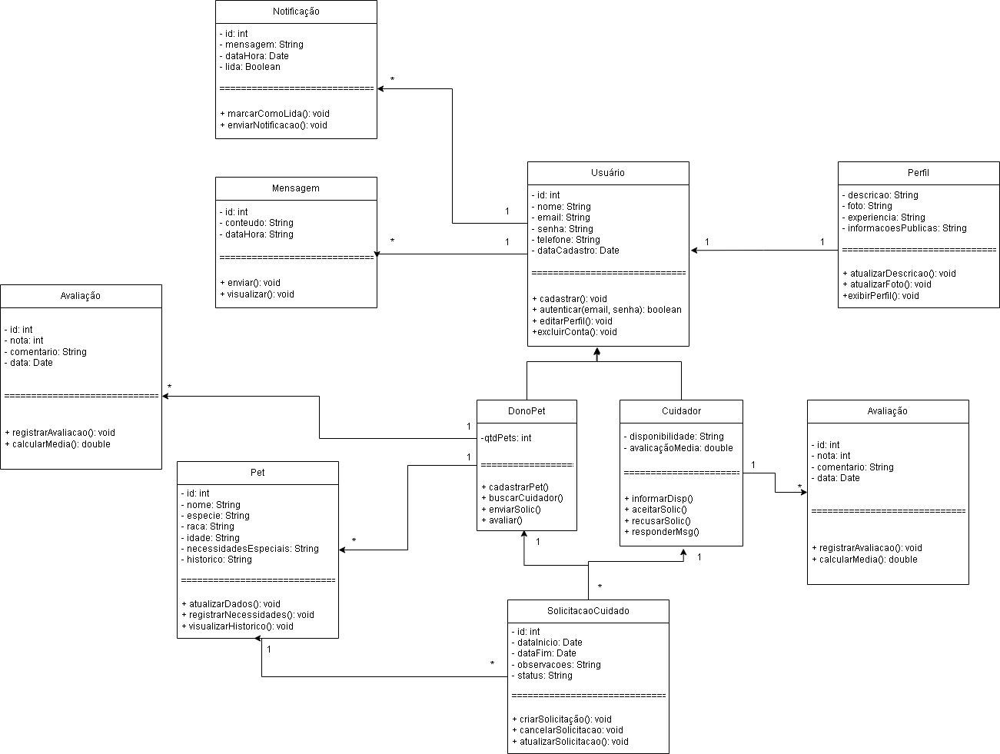

# 🐾 Sistema de Intermediação de Cuidados para Pets

## 📖 Descrição

Este projeto apresenta a modelagem orientada a objetos de um sistema de intermediação de cuidados para pets, desenvolvido para a disciplina de Engenharia de Software II.

O sistema tem como objetivo conectar donos de pets a cuidadores, permitindo:

- cadastro de usuários;
- gerenciamento de pets;
- solicitações de cuidado;
- troca de mensagens;
- notificações;
- avaliações de serviços.

---

# 📌 Diagrama de Classes



---

# 🧩 Classes do Sistema

## 👤 Classe Usuario

### Responsabilidades
- realizar cadastro;
- autenticar acesso;
- editar informações pessoais;
- gerenciar perfil.

### Atributos
| Atributo | Tipo |
|---|---|
| id | int |
| nome | String |
| email | String |
| senha | String |
| telefone | String |
| dataCadastro | Date |

### Métodos
```java
cadastrar()
autenticar(email, senha)
editarPerfil()
excluirConta()
```

---

## 🐶 Classe DonoPet

### Responsabilidades
- cadastrar pets;
- buscar cuidadores;
- enviar solicitações de cuidado;
- avaliar cuidadores.

### Atributos
| Atributo | Tipo |
|---|---|
| qtdPets | int |

### Métodos
```java
cadastrarPet()
buscarCuidador()
enviarSolic()
avaliar()
```

---

## 🩺 Classe Cuidador

### Responsabilidades
- informar disponibilidade;
- visualizar solicitações;
- aceitar ou recusar pedidos;
- responder mensagens.

### Atributos
| Atributo | Tipo |
|---|---|
| disponibilidade | String |
| avaliacaoMedia | double |

### Métodos
```java
informarDisp()
aceitarSolic()
recusarSolic()
responderMsg()
```

---

## 🪪 Classe Perfil

### Responsabilidades
- armazenar descrição do usuário;
- armazenar foto e informações públicas;
- exibir experiência e disponibilidade.

### Atributos
| Atributo | Tipo |
|---|---|
| descricao | String |
| foto | String |
| experiencia | String |
| informacoesPublicas | String |

### Métodos
```java
atualizarDescricao()
atualizarFoto()
exibirPerfil()
```

---

## 🐾 Classe Pet

### Responsabilidades
- armazenar informações do animal;
- registrar necessidades especiais;
- manter histórico do pet.

### Atributos
| Atributo | Tipo |
|---|---|
| id | int |
| nome | String |
| especie | String |
| raca | String |
| idade | int |
| necessidadesEspeciais | String |
| historico | String |

### Métodos
```java
atualizarDados()
registrarNecessidade()
visualizarHistorico()
```

---

## 📅 Classe SolicitacaoCuidado

### Responsabilidades
- registrar pedidos de cuidado;
- controlar status da solicitação;
- armazenar datas e observações;
- relacionar dono, cuidador e pet.

### Atributos
| Atributo | Tipo |
|---|---|
| id | int |
| dataInicio | Date |
| dataFim | Date |
| observacoes | String |
| status | String |

### Métodos
```java
criarSolicitacao()
cancelarSolicitacao()
atualizarStatus()
```

---

## 💬 Classe Mensagem

### Responsabilidades
- permitir comunicação entre usuários;
- armazenar mensagens enviadas;
- registrar data e horário das conversas.

### Atributos
| Atributo | Tipo |
|---|---|
| id | int |
| conteudo | String |
| dataHora | DateTime |

### Métodos
```java
enviar()
visualizar()
```

---

## 🔔 Classe Notificacao

### Responsabilidades
- informar alterações nas solicitações;
- alertar sobre novas mensagens;
- atualizar status de serviços.

### Atributos
| Atributo | Tipo |
|---|---|
| id | int |
| mensagem | String |
| dataHora | DateTime |
| lida | boolean |

### Métodos
```java
enviarNotificacao()
marcarComoLida()
```

---

## ⭐ Classe Avaliacao

### Responsabilidades
- registrar notas e comentários;
- calcular reputação do cuidador;
- armazenar feedbacks dos serviços realizados.

### Atributos
| Atributo | Tipo |
|---|---|
| id | int |
| nota | int |
| comentario | String |
| data | Date |

### Métodos
```java
registrarAvaliacao()
calcularMedia()
```

---

# 🔗 Relacionamentos Entre Classes

## Herança

```text
Usuario <|-- DonoPet
Usuario <|-- Cuidador
```

### Justificativa
DonoPet e Cuidador compartilham características comuns relacionadas ao gerenciamento da conta e autenticação, evitando duplicação de código através de herança.

---

## Associação: Usuario ↔ Perfil

```text
Usuario 1 ----- 1 Perfil
```

### Justificativa
Cada usuário possui um único perfil público contendo descrição, foto e experiência.

---

## Associação: DonoPet ↔ Pet

```text
DonoPet 1 ----- * Pet
```

### Justificativa
Um dono pode possuir vários pets, mas cada pet pertence a apenas um dono.

---

## Associação: SolicitacaoCuidado

```text
DonoPet 1 ----- * SolicitacaoCuidado
Cuidador 1 ----- * SolicitacaoCuidado
Pet 1 ----- * SolicitacaoCuidado
```

### Justificativa
A solicitação centraliza o relacionamento entre dono, cuidador e pet, armazenando o contexto completo do serviço.

---

## Associação: Mensagem

```text
Usuario 1 ----- * Mensagem
```

### Justificativa
Usuários podem trocar diversas mensagens ao longo da utilização da plataforma.

---

## Associação: Notificacao

```text
Usuario 1 ----- * Notificacao
```

### Justificativa
Um usuário pode receber várias notificações referentes a mensagens, solicitações e alterações de status.

---

## Associação: Avaliacao

```text
DonoPet 1 ----- * Avaliacao
Cuidador 1 ----- * Avaliacao
```

### Justificativa
As avaliações representam feedbacks realizados após a prestação do serviço de cuidado.

---

# 🏗️ Principais Decisões de Modelagem

## 1. Uso de Herança em Usuario

Foi utilizada herança para especializar os tipos de usuários do sistema:

- DonoPet
- Cuidador

Isso melhora:
- reutilização;
- manutenção;
- extensibilidade.

---

## 2. Separação da Classe Perfil

A classe `Perfil` foi separada da classe `Usuario` para manter melhor organização e separação de responsabilidades.

Essa abordagem facilita:
- manutenção;
- futuras expansões;
- gerenciamento de informações públicas.

---

## 3. Classe SolicitacaoCuidado como Elemento Central

A classe `SolicitacaoCuidado` centraliza:

- datas;
- status;
- observações;
- vínculos entre dono, cuidador e pet.

Isso melhora o controle do fluxo do serviço.

---

## 4. Separação Entre Mensagem e Notificacao

As classes foram modeladas separadamente pois possuem funções distintas:

- `Mensagem` → comunicação direta entre usuários;
- `Notificacao` → alertas automáticos do sistema.

---

## 5. Sistema de Avaliações

A classe `Avaliacao` permite registrar:

- notas;
- comentários;
- reputação do cuidador;
- feedback dos serviços realizados.

---

# 🚀 Possíveis Melhorias Futuras

O sistema pode futuramente incluir:

- pagamentos online;
- geolocalização;
- chat em tempo real;
- agenda/calendário;
- upload de documentos;
- autenticação OAuth;
- sistema de denúncias;
- recomendação inteligente de cuidadores.

---

# ✅ Conclusão

A modelagem proposta segue princípios da Programação Orientada a Objetos e boas práticas de Engenharia de Software, promovendo:

- baixo acoplamento;
- reutilização de código;
- facilidade de manutenção;
- escalabilidade futura.

A estrutura atende adequadamente aos principais requisitos funcionais do sistema de intermediação de cuidados para pets.
